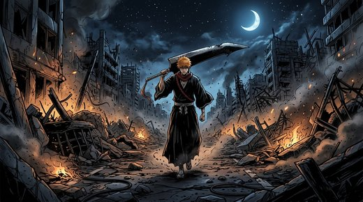
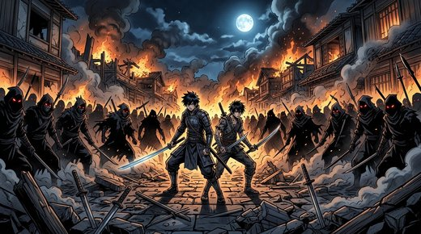
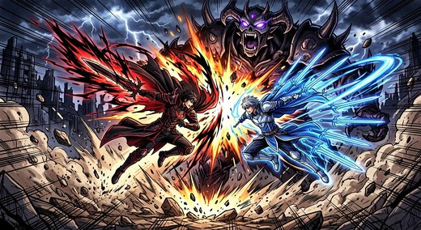

# New program 🎌♞

Репозиторий-песочница: **арт**, **PDF-комикс** и **шахматы на Python** в одном месте.

[](https://github.com/RatAndRu/Hello-program/actions/workflows/chess-tests.yml)

---

## 🎨 Арт: Ичиго и Кирито — братья по оружию


Двое напарников стоят спина к спине в разрушенном городе под серпом луны,
а вокруг смыкается кольцо теней. Оригинал в полном размере — в PNG:
[`art/ichigo_kirito_brothers.png`](art/ichigo_kirito_brothers.png).

## 📖 Комикс (PDF, 10 страниц)

**[⬇️ Скачать комикс: `comic/komiks_ichigo_i_kirito.pdf`](comic/komiks_ichigo_i_kirito.pdf)**

Полноценный PDF-комикс: обложка, 8 глав с картинками и подписями и финальная
страница. Идея та же — два мечника, которые прикрывают друг друга, и орда
противников, которая им не по зубам.

| Пролог | Легион | Братство | Один удар |
|:---:|:---:|:---:|:---:|
|  |  |  |  |

Из чего собран комикс:

```
comic/
├── komiks_ichigo_i_kirito.pdf   ← готовый PDF (открывается в браузере и в Adobe Reader)
└── panels/panel01..08.jpg       ← отдельные страницы-иллюстрации
tools/build_comic_pdf.py         ← скрипт сборки PDF (только Pillow)
```

Пересобрать PDF после правок:

```bash
pip install pillow
python tools/build_comic_pdf.py
```

## ♞ Шахматы на Python

Полноценные шахматы **одним файлом** — [`chess/chess.py`](chess/chess.py).
Никаких библиотек: только стандартный Python 3.

* все правила: рокировка, взятие на проходе, превращение, шах, мат, пат, ничьи;
* компьютерный соперник: минимакс + альфа-бета, 5 уровней сложности;
* два интерфейса: окно `tkinter` и консольный режим;
* подсказка, отмена хода, подсветка ходов;
* perft-тесты, которые подтверждают, что правила работают верно.


### Как запустить

**Windows — самый простой способ:** дважды кликнуть по **`start.vbs`** в корне проекта.
Скрипт сам найдёт Python и откроет игру (окно, а если tkinter нет — консоль).

**Вручную:**

```bash
python chess/chess.py             # окно (tkinter)
python chess/chess.py --console   # консоль
python chess/chess.py --perft     # проверить правила (тесты)
python chess/chess.py --level=4   # сразу сложный уровень
```

Больше деталей — в [`chess/README.md`](chess/README.md).

## 🗂️ Что где лежит

| Путь | Что это |
|---|---|
| `art/` | главный арт (PNG + JPEG) и миниатюры для README |
| `comic/` | PDF-комикс и страницы-панели |
| `chess/chess.py` | шахматы (движок + интерфейс) |
| `chess/start_chess.bat` | резервный запуск шахмат на Windows |
| `start.vbs` | **запуск программы одной двойной кнопкой мыши** |
| `tools/build_comic_pdf.py` | сборка PDF-комикса |
| `.github/workflows/chess-tests.yml` | автотесты шахмат на GitHub |

## ❓ Частые вопросы

**GitHub компилирует Python сам?**
Нет. GitHub — это хранилище + браузер кода: он красиво показывает `.py`, PDF и
картинки, но не запускает Python. Чтобы код проверялся сам, есть
**GitHub Actions** — я добавил туда workflow, и он при каждом `git push`
прогоняет `python chess.py --perft`. Зелёная галочка ✔ означает, что тесты прошли.

**Сколько всего можно хранить на GitHub?**
Репозиториев — сколько угодно, файл — до 100 МБ, репозиторий — до ~5 ГБ
(подробнее: [`docs/github-limits.md`](docs/github-limits.md)).

## 🛠️ Планы

- [ ] уровни сложности с «книгой дебютов»;
- [ ] запись партии в PGN;
- [ ] комикс в формате CBZ для читалок;
- [ ] страница-галерея на GitHub Pages.

---

Сделано с ♥ и большим количеством кофе.
