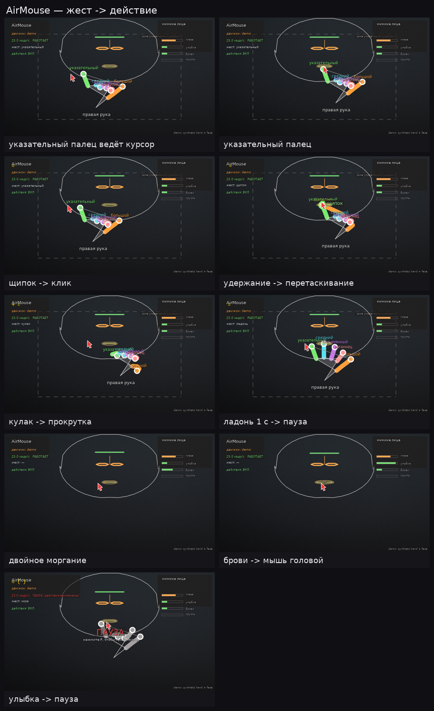
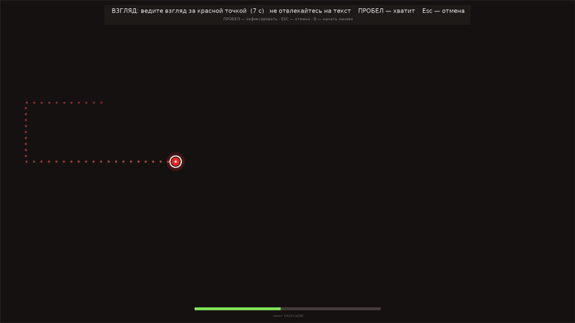

# AirMouse — управление компьютером жестами рук, мимикой и «чтением по губам»

Приложение работает в фоне, смотрит в веб-камеру и делает то, что делает человек:
двигает курсор, кликает, перетаскивает, прокручивает, ставит себя на паузу —
по жестам руки, морганию, улыбке и даже по словам, сказанным беззвучно.

Всё считается **локально**: ни одного запроса в интернет, ни одной языковой
модели, никакого облака. Камера не покидает ваш компьютер.


*Кадры из `python -m airmouse demo` — синтетическая рука и лицо проходят весь конвейер без камеры.*

---

## 0. Быстрый старт (Windows)

Всё уже упаковано: **`release/AirMouse-0.16.0.zip`** (или `release/` после
`python packaging/make_zip.py`).

1. Распакуйте архив в любую папку.
2. Запустите **`install.bat`** — создаст `.venv`, поставит зависимости,
   проверит камеру (2–5 минут, один раз).
3. Запустите **`run.bat`** — откроется окно предпросмотра и управление.

Фон без окна: **`run-background.bat`** (иконка в трее).
Свой EXE: **`build-exe.bat`** → `dist/AirMouse/AirMouse.exe` (Python на другой
машине уже не нужен). Такой же архив собирает GitHub Actions:
*Actions → «AirMouse — сборка Windows EXE»*.

Подробная пошаговая инструкция лежит рядом с архивом: `КАК-ЗАПУСТИТЬ.txt`.

---

## 1. Можно ли без ИИ? Честный ответ

Короткий ответ: **частично да, но не всё**. Разложим по слоям.

| Задача | Совсем без обучения (классическое CV) | Нейросеть локально (MediaPipe) | Облачная LLM |
|---|---|---|---|
| Найти кисть в кадре | ✅ цвет кожи + контуры + выпуклая оболочка | ✅ детектор ладони | не нужна |
| Управлять курсором | ✅ центр/верхушка силуэта | ✅ кончик указательного | не нужна |
| Клик, прокрутка | ⚠️ «сжатие кисти» — грубо | ✅ щипок, точное удержание | не нужна |
| 21 сустав кисти (щипок, драг) | ❌ ненадёжно на любом фоне | ✅ 21 точка, 30 fps на CPU | не нужна |
| Точки лица (веки, брови, губы) | ❌ только «дырка рта» на силуэте | ✅ 468 точек | не нужна |
| Мимика (моргание, улыбка) | ❌ | ✅ из геометрии точек, без обучения эмоций | не нужна |
| Чтение по губам | ⚠️ только свой словарь из 5–20 слов (DTW) | ⚠️ то же, но точнее | ✅ но это уже не «без ИИ» и не локально |

В проекте реализованы **оба пути**:

* `--backend mediapipe` (по умолчанию) — маленькие предобученные модели
  (≈8 МБ), работают офлайн на CPU. Это не ChatGPT и не «генеративный ИИ»:
  модели размечают точки, а все решения принимает обычная геометрия и
  конечные автоматы из этого репозитория.
* `--backend classical` — **вообще без нейросетей**: сегментация кожи по
  YCrCb/HSV, контуры, выпуклая оболочка, «звёздный скелет». Работает, но грубее:
  указатель — верхушка силуэта, клик — сжатие кисти, прокрутка — сжатие с
  движением. Нужен ровный свет и однотонный фон.

Чего без обучения не выйдет: устойчивого скелета кисти в любой позе и точных
точек лица. Если нужен «ноль нейросетей вообще» — берите `--backend classical`
и знайте, что мимика и губы в этом режиме отключены.

---

## 2. Что умеет

### Рука (по умолчанию)

| Жест | Действие |
|---|---|
| Указательный палец двигается | курсор едет за кончиком |
| Пальцы пошли на смыкание | «прицел»: курсор замирает на точке, появляется крестик |
| Щипок двумя пальцами (большой + указательный), быстро отпустить | левый клик — ровно в наведённую точку |
| Щипок и вести рукой (держать > 0.3 с) | перетаскивание (drag & drop) |
| Щипок большим + средним | правый клик |
| Кулак + движение вверх/вниз | прокрутка страницы |
| Большой палец вверх | двойной клик |
| Раскрытая ладонь **плоско, ладонью в камеру**, неподвижно 1.3 с | пауза / продолжить |
| «ОК» (колечко + три пальца вверх) | двойной клик |
| «Коза» (указательный + мизинец) | пауза / продолжить |
| Три пальца (указ., средний, безымянный) | включить / выключить «мышь головой» |

**Жесты не «дёргаются».** Нейросеть на быстром движении иногда на 1–2 кадра
складывает пальцы не туда — отсюда раньше проскакивали ложные клики. Теперь:

* щипок сглаживается медианой трёх кадров — одиночный выброс не считается щипком;
* клик требует удержания щипка не меньше `hand.pinch_min_s = 0.08` с;
* «прицел» включается только после двух кадров подряд, а не с одного мигания;
* поза с гистерезисом: если палец «на границе» выпрямлен/согнут, жест не меняется;
* щипок считается **только настоящим щипком двумя пальцами**: мало того, что
  кончики большого и указательного сошлись — указательный должен быть
  выпрямлен и уходить от своего основания. Поэтому **кулак** и жест **«ОК»**
  (колечко из большого и указательного) щипком больше не считаются и клик не
  дают. Если начать щипок и сжать кулак — щипок отменяется без клика.

### Ладонью или тылом — разные команды

Одни и те же позы читаются по-разному, если кисть повёрнута тылом к камере.
Направление ладони считается по 21 точке (`z` от MediaPipe): двойное векторное
произведение запястья и трёх оснований пальцев даёт «нормаль ладони».

**Одна калибровка.** Покажите ладонь в камеру и нажмите `K` (или кнопку
**«КАЛИБРОВАТЬ ЛАДОНЬ (K)»** на странице «Режимы»). Всё, что покажет такую же
нормаль, считается ладонью, противоположное — тылом. Если перепутали —
кнопка **«ИНВЕРТИРОВАТЬ»**.

| Поза | Ладонью к камере | Тылом к камере |
|---|---|---|
| «ОК» (колечко + три пальца) | двойной клик | правый клик |
| «Коза» | пауза / продолжить | двойной клик |
| Три пальца (указ., средний, безымянный) | «мышь головой» вкл/выкл | пауза / продолжить |

Что важно:

* **Без калибровки** сторона — «не определена», работают только жесты ладонью;
  в окне так и написано: «сторона кисти: не определена (K — показать ладонь)».
* **Гистерезис.** Сторона меняется только после 3 одинаковых кадров
  (`hand.side_min_frames`), а когда кисть стоит ребром (`|нормаль|` ниже
  `hand.side_min_score`), сторона просто держится прежней — не мигает.
* Переключатель **«ТЫЛОМ: ВКЛ/ВЫКЛ»** (`hand.side_actions`) выключает всю
  «тыльную» логику: тогда позы всегда работают как ладонью.
* Свои команды для тыла — в `mapping`, ключи `ok_sign_back`, `rock_sign_back`,
  `three_fingers_back`:
  ```bash
  python -m airmouse config set actions.mapping.ok_sign_back=hotkey:ctrl+z
  ```

### Глаза: зрачки и «мышь глазами»

FaceMesh с `refine_landmarks` отдаёт **478 точек**: 468 лица + 10 радужки
(центр зрачка + 4 точки по кругу на каждый глаз). По ним считается, куда
смотрит человек: положение зрачка внутри глазницы, в долях её полуширины и
полувысоты. Своё «прямо» запоминается автоматически — нейтраль подстраивается
под посадку головы и камеру, поэтому калибровать не нужно.

Клавиша **`G`** (или кнопка **«Мышь глазами: курсор от зрачков»** на странице
«Режимы», или `--gaze-mouse`) включает управление курсором глазами. Режимов два.

**Телепорт по калибровке (по умолчанию, если калибровка есть).** Курсор
оказывается сразу там, куда вы смотрите — косить глазами не нужно:

* клавиша **`B`** (или кнопка **«КАЛИБРОВАТЬ ВЗГЛЯД (B)»** на странице
  «Моргание и глаза») запускает мастер: **9 точек** — сетка 3×3 по всему экрану
  (четыре самых угла, середина каждой стороны и центр);
* окно при этом **разворачивается на весь монитор**, фон становится чёрным, а
  прицел (зелёный «уголок») стоит **в самом углу экрана**, а не внутри окна —
  поэтому калибровка получается на весь экран, а не на маленькое окошко
  предпросмотра;
* холст калибровки рисуется **ровно в размере окна** (`getWindowImageRect`), а
  не в «размере из настроек мыши». Иначе на экране с масштабом 125% окно
  растягивало картинку, всё выглядело крупнее, а прицел уезжал с угла. Теперь
  один пиксель холста = один пиксель экрана, а прицел стоит в самом угловом
  пикселе (`0` и `width-1`);
* внизу экрана калибровки мелким шрифтом написано, что происходит:
  `экран 1920×1080 · окно 1920×1080 · холст 1920×1080`. Если там «окно меньше
  экрана» — приложение не смогло занять весь монитор; оно само повторит
  попытку, а помогает клавиша `F`;
* на каждой точке смотрите на прицел и нажимаете **пробел** (Esc — отмена,
  `B` — начать заново); достаточно полусекунды; внизу видны девять точек —
  сколько шагов уже пройдено;
* по девяти точкам подбирается **проективное** преобразование (гомография,
  DLT + нормировка Хартли): глаз смотрит на плоский экран под углом, и «по осям»
  такой наклон не описать — аффинная подгонка давала промах до 18% экрана в
  углах, гомография попадает в доли процента. Оно сохраняется в
  `face.gaze_calibration` — калибровка делается один раз, для любой веб-камеры
  и любой посадки головы;
* сразу после точек — **короткая вторая фаза (6 секунд): «не отводя взгляда от
  центра, поверните голову влево-вправо и вверх-вниз»**. По этим кадрам
  подбирается поправка на поворот головы: когда голова поворачивается, а глаза
  смотрят в ту же точку, положение зрачка в глазнице всё равно уезжает (веко и
  уголки глаз лежат на разной глубине). Наклон «зрачок на градус поворота»
  снимается с вас и вычитается — **курсор стоит, пока взгляд стоит**, как бы вы
  ни крутили головой. Пробел — пропустить (тогда поправки не будет, вместо неё
  просто сглаживание). В журнале после этого:
  `калибровка взгляда готова: 9 точек, ошибка 1.4% экрана (макс 2.1%, точек 9), поворот головы: поправка +0.31/-0.14`;
* после девятой точки приложение **само проверяет калибровку** и пишет в журнал
  `ошибка 1.2% экрана (макс 2.5%, точек 9)`. Если промах больше 8% экрана —
  в окне появляется предупреждение «калибровка неточная, повторите» (обычно это
  значит, что смотрели мимо уголка или веко перекрывало радужку);
* калибровка, сделанная в старых версиях (по пяти точкам, «по осям»), помечается
  как **старый образец** — в журнале `калибровка старого образца, нажмите B`;
  она ещё работает, но её стоит перепройти: без гомографии углы экрана врут;
* дальше курсор сглаживается и не дёргается на дрожании зрачка
  (`face.gaze_deadzone_px = 12` пикселей), а крупные переводы взгляда проходят
  мгновенно — это и есть «телепорт»;
* координаты считаются без «полупиксельных» сдвигов: доля `0` — это первый
  пиксель экрана, `1` — последний (`width-1`, `height-1`). До самого края
  курсор доходит, но ровно в аварийный угол `(0,0)` не ставится — pyautogui
  считает его стоп-кнопкой и бросает исключение.


*Калибровка идёт на весь монитор: прицел-уголок стоит в самом углу экрана.
Посмотрели в угол, нажали пробел. Крутится один раз.*

**Скоростной режим (без калибровки).** Пока калибровки нет, работает запасной
вариант: чем дальше зрачок от нейтрали, тем быстрее едет курсор.

* пока зрачок в мёртвой зоне (`face.gaze_deadzone` / `face.gaze_deadzone_y`) —
  курсор стоит;
* отвели взгляд — курсор едет со скоростью до `face.gaze_speed_px_s` (800 px/с);
* вернули взгляд в центр — курсор встал (это скорость, а не абсолютная позиция).

Про «микросмещения»: радужка MediaPipe отдаётся с точностью около пикселя, а
перевод в координаты экрана приходится делать по калибровке — без неё мелкие
движения неотличимы от дрожания, с ней же работают десятые доли градуса.

**Глаза работают и при выключенном режиме «Лицо»**: точки лица нужны не только
мимике, поэтому распознаются всегда (кроме `--no-face`), а жесты мимики просто
не нажимают.

**По вертикали зрачок ходит в 2–3 раза меньше, чем по горизонтали**, поэтому у
осей свои настройки: мёртвая зона `gaze_deadzone_y = 0.04` против `0.07` по
горизонтали и свой «полный размах» `gaze_full_scale_y = 0.16` против
`gaze_full_scale_x = 0.22`. Со «общей» шкалой вверх-вниз не двигалось вообще.

**Нейтраль взгляда не «съедает» движение.** Свой ноль (`face.gaze_neutral_drift`)
подстраивается только когда зрачок рядом с ним — иначе через пару секунд
отклонение обнулялось и курсор замирал.

Настройки: `face.gaze_speed_px_s`, `face.gaze_deadzone`, `face.gaze_deadzone_y`,
`face.gaze_full_scale_x/y`, `face.gaze_smoothing`, `face.gaze_max_step_px` — все
есть ползунками на странице **«Моргание и глаза»** панели `C`. В окне видно
строку **«взгляд: вниз»**, а в панели мимики — зрачки на лице.

Честно про ограничения: глазами удобно «доводить» курсор и двигать его
крупно, но не кликать по мелким кнопкам — зрачок дрожит (саккады). Поэтому
«мышь глазами» — дополнение к руке и голове, а не замена: клик всё равно
удобнее щипком.

**Две руки — по ролям (`hand.roles = split`, кнопка «Вторая рука»).** Одна рука
только ведёт курсор, вторая только нажимает: щипок второй рукой кликает, но
курсор при этом не сдвигается ни на пиксель. В окне у второй руки подписано
«вторая рука: нажатия и жесты», в сводке — «роли: 1 — курсор, 2 — клики». Можно
и командой:

```bash
python -m airmouse config set hand.roles=split
python -m airmouse config set hand.roles=single   # вернуть как было
```

Главной (той, что ведёт курсор) остаётся рука, которую программа увидела первой
и которая крупнее в кадре — она же не «перехватывается» второй рукой.

**В двуручных режимах жесты проще.** Когда включены «Вторая рука» или «Две
руки», рука занята одной задачей и ложных срабатываний меньше — поэтому щипок
там ловится с меньшим запасом: порог смыкания выше на `0.05`, отпускание — на
`0.06`, минимальное удержание вдвое короче, жест стабилизируется на кадр
быстрее (в режиме «Вторая рука» — полностью, в «масштаб/прокрутка» — наполовину,
плюс мёртвая зона движения рук меньше на треть). Включается переключателем
**«Двумя руками: щипок проще»** на странице «Режимы» (`hand.simple_two_hand`,
по умолчанию `ВКЛ`); выключите — требования станут строгими, как в одноручном.

### Режимы управления: включаются кнопками и сочетаются

Режимы независимы друг от друга — можно включить любой набор сразу. Кнопки
живут на странице **«Режимы»** панели настроек (клавиша `C`), плюс есть клавиша
`V`, которая перебирает готовые наборы по кругу.

| Режим | Что делает | Как включить |
|---|---|---|
| **Рука** (включена всегда) | одна рука ведёт курсор, кликает, показывает жесты | по умолчанию |
| **Вторая рука: нажатия** | первая рука ведёт курсор, вторая только нажимает и показывает жесты | переключатель «Вторая рука» |
| **Две руки: масштаб** | обе ладони — развести/свести = Ctrl+колесо | переключатель «Две руки: масштаб» |
| **Две руки: прокрутка** | два кулака вверх/вниз | переключатель «Две руки: прокрутка» |
| **Двумя руками: щипок проще** | в двуручных режимах щипок ловится с меньшим запасом | переключатель «Двумя руками: щипок проще» (по умолчанию ВКЛ) |
| **Лицо** | мимика показывается в окне, моргание/подмигивание — клики | переключатель «Лицо» |
| **Мышь головой** | наклон головы двигает курсор | переключатель «Мышь головой» (или `H`) |
| **Мышь глазами** | курсор телепортируется туда, куда смотрите (после калибровки `B`) | переключатель «Мышь глазами» (или `G`) |

Готовые наборы (кнопки на странице «Режимы»): **РУКА**, **РУКА + ЛИЦО**,
**ДВЕ РУКИ**, **ТОЛЬКО ЛИЦО**. Клавиша `V` листает их по кругу.

Что важно про сочетания:

* **По умолчанию — одна рука.** Вторая рука в кадре только рисуется: она не
  двигает курсор, не масштабирует и не нажимает (`hand.roles=single`,
  `hand.two_hand=off`).
* **Лицо и рука работают вместе.** Включили «Лицо» — рука продолжает вести
  курсор, а мимика и моргание работают параллельно.
* **Лицо + две руки.** В режиме нажатий: первая рука ведёт курсор, вторая
  кликает, мимика кликает и показывает выражения — всё одновременно.
* **Только лицо.** Выключите «Рука» — руки в кадре рисуются, но ничего не
  нажимают, управление остаётся за лицом и головой.
* «Вторая рука: нажатия» и «Две руки» взаимоисключающие: это одни и те же две
  руки в кадре. Переключатель сам снимает другой режим.

В окне всегда видно, что включено: строка **«режимы: рука + лицо»** и строка
ролей в режиме двух рук.

### Лицо

| Мимика | Действие |
|---|---|
| Двойное моргание | левый клик |
| Подмигивание (один глаз) | правый клик |
| Улыбка 0.45 с | пауза / продолжить |
| Поднятые брови 0.5 с | включить / выключить «мышь головой» |
| «Мышь головой» включена (клавиша `H`) | курсор едет от наклона головы; возврат головы в норму курсор не тянет назад |

#### Моргание и подмигивание: что считается

Моргание и «зажмурился» — это события, которые могут нажимать, поэтому здесь
важна дисциплина. Правила такие:

| Что видит камера | Что считает приложение |
|---|---|
| Оба глаза закрылись и открылись вместе | **моргание**; два моргания подряд в пределах `face.double_blink_window_s` — «двойное моргание» (левый клик) |
| Закрылся **ровно один** глаз, второй за это время ни разу не закрылся | **подмигивание** (правый клик) |
| Оба глаза закрылись (даже если один чуть раньше) | подмигивания **не будет**: это моргание |
| Второй глаз моргнул посреди «подмигивания» | тоже не подмигивание |
| Глаза закрыты меньше `face.blink_min_s` (0.09 с) | ничего: случайное прищуривание не считается |
| Один глаз закрыт меньше `face.wink_min_s` (0.25 с) | не подмигивание |
| Оба глаза закрыты дольше `face.blink_max_s` (0.45 с) | «глаза закрыты» — одно событие на эпизод, не моргание |
| Оба глаза закрыты дольше `face.eyes_closed_cap_s` (4 с) | **ничего не засчитывается**, пока глаза не откроются |

Раньше моргание считалось «по глазу»: при закрытии обоих глаз первый глаз
успевал насчитать моргание, а второй тут же превращал его в «двойное» — и
обычное моргание кликало. Теперь событие ровно одно на эпизод.

Крутилки — на странице **«Моргание и глаза»** (`C` → `5`) или в конфиге:
`face.blink_min_s`, `face.wink_min_s`, `face.eyes_closed_cap_s`.

### Мышь головой — как это ощущается

Наклон головы двигает курсор с заметной скоростью: `face.head_gain_x = 26` и
`face.head_gain_y = 20` пикселей в секунду на градус (раньше было ~0.3 px/с —
поэтому курсор «ел на миллиметр»). Передача **нелинейная**: у самой границы
мёртвой зоны курсор идёт медленно (удобно доводить точно), а на большом наклоне
разгоняется (быстро перебросить через экран) — так сделано в HeadShift
(Kim et al., CHI 2024): линейный gain давал больше промахов по мелким целям и
ощущался вялым на больших расстояниях. Кривизна — `face.head_accel = 0.06`
(0 — снова линейно). Мёртвая зона `face.head_deadzone_deg = 2.5°`:
пока голова в ней, курсор стоит. Вернули голову в нормальное положение — курсор
остался на месте, обратной траектории нет; следующее движение начнётся только
когда голова снова уйдёт за мёртвую зону. Чувствительность меняется без правки
кода:

```bash
python -m airmouse config set face.head_gain_x=40 face.head_gain_y=30
```

Все пороги и привязки — в `config/airmouse.json`, менять можно без правки кода.
Например: `python -m airmouse config set actions.mapping.thumb_up=right_click`.

### Тело целиком: приседания, наклон, руки вверх

«Свой кинект» по одной веб-камере: MediaPipe Pose отдаёт **33 точки** (суставы,
стопы, голова), по ним считаются углы и поза. Режим включается флагом `--body`
или настройкой `body.enabled` — по умолчанию выключен, потому что это ещё одна
модель (~5 МБ) и ещё немного CPU.

Что показывает окно: `тело: стоит · приседаний 3`, во время приседа —
`тело: приседает · приседаний 3 · глубина 62%`.

Что умеет:

| Поза | Как ловится | Настройка |
|---|---|---|
| **Присед** | глубина 0..1 по двум сигналам: угол в колене (работает сбоку) и просадка таза относительно роста (работает спереди) | `body.squat_down = 0.45`, `body.squat_up = 0.18` |
| **Повтор приседания** | переход «вниз → вверх» с гистерезисом и минимальной длительностью 0.35 с | `body.squat_min_s` |
| **Наклон** | корпус ушёл от вертикали больше 25° | `body.lean_deg` |
| **Руки вверх** | запястья выше плеч, удержание 0.8 с | `body.arms_up_hold_s` |

Повторы по умолчанию только **считаются** — в журнал и в окно. Чтобы жест что-то
делал, привяжите действие:

```bash
python -m airmouse config set actions.mapping.squat_rep=toggle_pause
python -m airmouse config set actions.mapping.arms_up_hold=left_click
```

**Честные ограничения.** Глубины у камеры нет: человек в кадре должен быть один
(Pose не различает людей), перекрытая рука/нога не восстанавливается. Точность
углов у BlazePose средняя: в валидационном исследовании средняя ошибка угла в
колене ~7° (ICC ≈ 0.77 для приседа, Yue et al., 2026) — поэтому пороги широкие,
а счёт повторов с гистерезисом. Для упражнений камера лучше сбоку: спереди угол
в колене «смотрит в объектив» и врёт, поэтому там работает второй сигнал —
просадка таза.

### Губы (экспериментально, по желанию)

Свой словарь из 5–20 слов. Вы один раз записываете по 6–10 повторов слова,
дальше приложение узнаёт его по форме губ (DTW-сопоставление траекторий) и
выполняет привязанное действие. Подробности — в разделе 6.

---

## 3. Установка

Нужен Python **3.10–3.12** (у MediaPipe пока нет колёс под 3.13+).

**Windows** — проще всего через `install.bat` (см. раздел 0). Вручную:

```bat
py -3.12 -m venv .venv
.venv\Scripts\activate
pip install -r requirements.txt
python -m airmouse doctor
python run_airmouse.py
```

**Linux**

```bash
python3 -m venv .venv && . .venv/bin/activate
pip install -r requirements.txt
# для классического бэкенда и оверлея нужен только OpenCV; на Wayland
# управление мышью через pyautogui может требовать X11 (XWayland)
python run_airmouse.py
```

**macOS**: то же самое, но при первом запуске выдайте терминалу разрешения
«Камера» и «Универсальный доступ» (System Settings → Privacy & Security).

Первый запуск с MediaPipe 1.x скачает модели в `models/` (≈8 МБ, один раз).
Можно скачать заранее: `python -m airmouse models`. Если сети нет —
`pip install "mediapipe<1"`: в версиях 0.10.x модели лежат внутри пакета.

---

## 4. Запуск

```bash
python run_airmouse.py                  # окно предпросмотра + управление
python run_airmouse.py --dry-run        # всё считает, но НЕ двигает мышь
python run_airmouse.py --no-window      # в фоне, иконка в трее
python run_airmouse.py --backend classical   # вообще без нейросетей
python run_airmouse.py --video запись.mp4    # отладка на записи вместо камеры
python run_airmouse.py --no-face        # только рука (меньше нагрузка на CPU)
python run_airmouse.py --lip            # включить распознавание слов по губам
python run_airmouse.py --warmup 4       # больше времени, чтобы встать в кадр
```

Первые 2 секунды после старта приложение только распознаёт, но ничего не
нажимает («GET READY» в окне) — чтобы случайный клик не улетел в открытую форму.

Или `python -m airmouse ...` — то же самое, если пакет установлен.

**Горячие клавиши в окне:** `Q`/`Esc` — выход, `P` — пауза, `H` — «мышь головой»,
`G` — «мышь глазами», `B` — калибровка взгляда, `K` — запомнить сторону ладони,
`F` — окно предпросмотра на весь экран, `C` — настройки,
`V` — режимы, `M` — сменить движок (нейросеть ↔ классический CV),
`I`/`Tab` — справка по всем жестам, `Пробел` — статистика в лог.

Клавиши работают **в любой раскладке**: на русской `Й` — это `Q`, `З` — `P`,
`П` — `G`, `Л` — `K` и так далее. Ничего переключать не нужно. Крестик окна завершает приложение.
В фоновом режиме — меню иконки в трее.

**Прицел.** Когда вы сводите большой и указательный палец, курсор замирает на
последней точке (`hand.pinch_approach_ratio = 0.5`), поэтому клик попадает туда,
куда целились, а не туда, куда «уехал» палец при смыкании.

**В кадре распознаются **обе руки** (`hand.max_hands = 2`): главная управляет
курсором и жестами, вторая только рисуется и подписана «вторая рука (не
управляет)» — так руки не перехватывают управление друг у друга
(`docs/overlay-two-hands.png`). Жесты двумя руками: обе ладони — масштаб
(Ctrl+колесо), два кулака — прокрутка. Эти жесты — отдельный режим
(`hand.two_hand = zoom|scroll|off`), по умолчанию выключен: в стандартном режиме
вторая рука ничего не меняет.
Если удобнее разделить обязанности, включите `hand.roles = split`: одна рука
только двигает курсор, вторая только нажимает (см. раздел 2).

**Мимика и голова.** Распознаются улыбка, грусть (опущенные уголки), удивление
(брови + рот), подмигивание, закрытые глаза, а также кивок и поворот головой
(по колебаниям углов). Всё это подписывается в окне словами; действия по
мимике и голове по умолчанию выключены, например
`config set actions.mapping.head_nod=left_click`. Клавиша `H` — «мышь головой»:
наклон головы двигает курсор (мёртвая зона 2.5°, возврат головы в норму курсор
назад не тянет).

**Мимика по умолчанию только отображается.** Улыбка и поднятые брови раньше
сами ставили паузу и включали «мышь головой», что давало ложные срабатывания
при обычном разговоре. Теперь действия по ним нужно включить явно:
`python -m airmouse config set actions.mapping.smile_hold=toggle_pause`.
Двойное моргание и подмигивание работают как раньше. Пауза «ладонью» стала
строже: ладонь открыта и неподвижна 1.3 с, кадр с крупной ладонью, не чаще
одного раза в 2.5 с; пока идёт перетаскивание, мимика не вмешивается.

**Раскрытая ладонь — только настоящая ладонь.** Раньше «ладонью» считалась любая
кисть с четырьмя выпрямленными пальцами: рука под углом, кисть ребром, мятая
ладонь и даже тыл. Теперь жест проверяет геометрию по 3D-точкам:

* **плоскость** — все 21 точка кисти лежат в одной плоскости
  (`hand.palm_flat_max = 0.17`); пальцы, поджатые к ладони, отсекаются;
* **развёрнутость** — косинус угла между ладонью и камерой не меньше
  `hand.palm_facing_min = 0.75` (примерно 41°): рука «наискосок» и ребром — не
  жест;
* **сторона** — тыл кисти не считается ладонью (`hand.palm_need_side`); сторона
  берётся из калибровки `K`, без неё жест работает как раньше.

Если рука поднята, а пауза не срабатывает, в журнале окна так и написано:
`ладонь: ладонь под углом 55° — разверните её прямо в камеру` или
`ладонь: это тыл кисти — разверните её ладонью` (не чаще раза в 8 секунд, чтобы
не засорять журнал).

**Что показывает окно** (`docs/overlay-hand.png`, `docs/overlay-help.png`):

* цветные полосы вдоль каждого пальца — нейросеть видит руку (21 точка), у
  кончиков стоят точки, сведение большого и указательного подписано «щипок»;
* овал лица, глаза, брови и губы — лицо распознано (468 точек), рядом текущее
  выражение словами («улыбка 78%», «глаза закрыты», «брови подняты»);
* слева сверху — каким движком работаем, кадры в секунду, текущий жест и
  включены ли действия (`действия: ВКЛ`), слева снизу — что и когда произошло;
* клавиша `C` — панель настроек: страница «Режимы» с кнопками и ползунки
  калибровки (`docs/overlay-settings.png`, `docs/overlay-settings-cursor.png`);
* клавиша `V` — перебор режимов: рука → рука + лицо → две руки → только лицо;
* клавиша `K` — «показать ладонь»: одна калибровка стороны кисти;
* флаг `--body` — распознавать тело целиком (приседания, наклон, руки вверх);
* клавиша `G` — «мышь глазами»; `B` — калибровка взгляда (9 точек сеткой 3×3 на
  весь монитор + 6 секунд «повертите головой», чтобы курсор не прыгал);
* клавиша `F` — окно предпросмотра на весь экран (и `fullscreen: true` в конфиге);
* строка «режимы: рука + лицо» и «сторона кисти: ладонь» — что происходит сейчас.

Если MediaPipe не поднялся (нет моделей рядом с EXE, битая библиотека),
приложение не падает и не молчит: включается классическое CV, а под панелью
пишется причина. Переключить движок можно клавишей `M` или флагом
`--backend mediapipe|classical`. Проверка без камеры:
`AirMouse-debug.exe doctor --no-camera`.

**Автозапуск при входе в Windows:**

```bat
python -m airmouse autostart install
python -m airmouse autostart status
python -m airmouse autostart remove
```

### Диагностика

```bash
python -m airmouse doctor      # версии, камера, экран, модели, словарь
python -m airmouse selftest    # 19 проверок логики без камеры, ~1 с
python -m airmouse demo        # гифка + раскадровка + журнал в output/
python packaging/make_zip.py   # пересобрать ZIP для переноса на другой ПК
```

---

## 5. Безопасность (важно)

Управление мышью — это реальные клики. Поэтому в приложении есть три тормоза:

1. **Пауза** — раскрытая ладонь, улыбка или клавиша `P`. На паузе игнорируется
   всё, кроме снятия паузы.
2. **Аварийный стоп pyautogui**: уведите мышь в **левый верхний угол экрана** —
   библиотека выбросит `FailSafeException`, приложение само уйдёт на паузу.
3. **`Ctrl+C`** в консоли или «Выход» в трее — всё отпускается, кнопки не залипают.

Начинайте с `--dry-run`: видно, что приложение собирается сделать, но ничего
не нажимается. И не запускайте управление в моменты, когда клик может быть
опасен (открытые формы, платежи, удаление файлов) — это инструмент, а не страховка.

---

## 6. Чтение по губам: как это работает

Никаких нейросетей-транскрайберов. Классическая схема «признаки + DTW»:

```
468 точек лица → 8 признаков формы губ (раствор, ширины, толщины, площадь,
подъём уголков, протрузия) → нормировка на межзрачковое расстояние
→ вычитание нейтрального кадра → сравнение траектории с шаблонами (DTW)
```

1. Запишите слово (или несколько) по 6–10 повторов:

```bash
python -m airmouse lip record -w "стоп" --reps 8 --action toggle_pause
python -m airmouse lip record -w "дальше,назад" --reps 6 \
       --action key:space
```

   Рот перед словом должен быть закрыт; говорите беззвучно, но артикулируйте.
2. Посмотрите словарь: `python -m airmouse lip list`.
3. Проверьте в реальном времени: `python -m airmouse lip test` — печатает
   слово и расстояние до лучшего и второго кандидата. Если слова путаются,
   увеличьте `lip.max_distance` или перезапишите шаблоны.
4. Включите в рабочем режиме: `python run_airmouse.py --lip`.

**Ограничения честно:** это «свой» словарь — он работает для вашего лица и
вашей манеры говорить, а не для любого человека. 5–20 слов, разные по форме
(«стоп», «дальше», «назад», «клик», «пуск») — норма; «бит» и «бид» — нет.

---

## 7. Настройка

### Ползунки в самом приложении (клавиша `C`)

Не обязательно лезть в JSON: в окне предпросмотра нажмите **`C`** — откроется
панель с ползунками (`docs/overlay-settings.png`). Пока она открыта, управление
мышью на паузе, поэтому курсор не убегает из-под руки прямо во время
перетаскивания ползунка.

| Страница | Что настраивается |
|---|---|
| **0. Режимы** | кнопки-переключатели: рука, вторая рука, две руки (масштаб/прокрутка), лицо, мышь головой + готовые наборы |
| **1. Курсор** | где рука «достаёт» до края экрана (слева/справа/сверху/снизу — это и есть сдвиг курсора), сглаживание, мёртвая зона против дрожания, предел рывка |
| **2. Щипок и клики** | порог смыкания щипка, когда включается «прицел», минимальное удержание (антидребезг), задержка перетаскивания, пауза между кликами, строгость жестов, насколько выпрямлен указательный для щипка (кулак и «ОК» не считаются), пауза по ладони, скорость прокрутки кулаком |
| **3. Голова и руки** | чувствительность «мыши головой» по горизонтали и вертикали, её мёртвая зона, уверенность «это рука», скорость масштаба и прокрутки двумя руками |
| **4. Моргание и глаза** | время захвата моргания, сколько держать подмигивание, предел «глаза закрыты», скорость/зоны/размахи «мыши глазами», кнопки калибровки взгляда |

* Ползунок тянется мышью; значение подписано справа, изменённое от заводского
  подсвечивается зелёным, внизу — сколько параметров вы поменяли.
* `1`…`5` или `Tab` — переключение страниц.
* **СОХРАНИТЬ** — записать в `config/airmouse.json` и закрыть; **СБРОС** —
  вернуть заводские значения; **ЗАКРЫТЬ** — выйти (изменения сохраняются, если
  вы что-то двигали).
* Внизу панели идёт живая строка: текущий щипок, распознанный жест и кадры в
  секунду — видно эффект ползунка сразу.

Клавиши: `C` — панель настроек, `V` — режим по кругу, `K` — калибровка стороны
кисти (в приложении), `S` — сохранить, `R` — сброс, `Esc` — закрыть.

### Файл настроек

Конфигурация создаётся при первом запуске: `config/airmouse.json`.

| Параметр | Смысл |
|---|---|
| `hand.pinch_ratio` / `pinch_release_ratio` | порог щипка и его отпускания (гистерезис) |
| `hand.drag_delay_s` | сколько держать щипок, чтобы началось перетаскивание |
| `hand.pose_stable_frames` | сколько кадров жест должен держаться |
| `hand.pinch_min_s` | короче этого щипок не считается кликом (антидребезг) |
| `hand.pinch_min_index_ext` / `pinch_min_tip_out` | насколько должен быть выпрямлен указательный, чтобы щипок считался настоящим (кулак и «ОК» отсекаются) |
| `hand.simple_two_hand` | `true` — в двуручных режимах жесты проще (по умолчанию), `false` — строго всегда |
| `hand.roles` | `single` — одна рука на всё; `split` — первая ведёт курсор, вторая нажимает |
| `hand.two_hand` | `zoom` / `scroll` / `off` — режим «две руки» (по умолчанию `off`) |
| `hand.open_palm_hold_s` | сколько держать ладонь для паузы |
| `hand.settle_s` | «затишье» после возврата руки в кадр: без случайных кликов |
| `body.enabled` | распознавать тело целиком (приседания, наклон, руки вверх) |
| `body.squat_down` / `body.squat_up` | пороги глубины приседа (гистерезис) |
| `body.squat_min_s` | короче этого повтор не считается |
| `body.lean_deg` / `body.arms_up_hold_s` | наклон и удержание «руки вверх» |
| `face.head_accel` | нелинейность «мыши головой» (0 — линейно) |
| `face.gaze_dwell_click` / `gaze_dwell_s` | клик удержанием взгляда и его время (600 мс) |
| `hand.palm_flat_max` / `palm_facing_min` | насколько строго требовать «плоскую ладонь ровно в камеру» |
| `hand.palm_need_side` | `false` — разрешить паузу тыльной стороной кисти |
| `hand.fist_scroll_gain` | «скорость» прокрутки кулаком |
| `face.ear_blink` / `ear_open` | порог закрытых глаз (EAR) |
| `face.smile_delta` / `brow_delta` | чувствительность к улыбке и бровям |
| `fullscreen` | `true` — окно предпросмотра открывается на весь экран (клавиша `F`) |
| `face.head_gain_x/y` | скорость курсора от наклона головы (пикселей/с на градус) |
| `face.head_deadzone_deg` | мёртвая зона «мыши головой» |
| `pointer.active_box` | зона кадра, которая растягивается на весь экран |
| `pointer.min_cutoff` / `beta` | сглаживание 1€-фильтра (меньше — плавнее) |
| `pointer.relative_mode` | `true` — режим «джойстика» вместо абсолютного |
| `warmup_s` | сколько секунд после старта не нажимать (по умолчанию 2) |
| `actions.mapping` | какие жесты к каким действиям привязаны |
| `lip.words` | слово → действие |

Действия: `left_click`, `right_click`, `middle_click`, `double_click`,
`toggle_pause`, `toggle_head_pointer`, `toggle_overlay`, `scroll_up`,
`scroll_down`, `key:<клавиша>`, `hotkey:ctrl+z`, `none`.

Правка из консоли:

```bash
python -m airmouse config set hand.pinch_ratio=0.30 pointer.min_cutoff=0.8
python -m airmouse config show
```

---

## 8. Как это устроено

```
камера (поток)  ─►  tracker (MediaPipe / классическое CV)
                         │
        ┌────────────────┴─────────────────┐
        ▼                                  ▼
  gestures.HandFSM                    face.FaceFSM (+ lipreading.LipReader)
  (поза, щипок, драг, кулак)          (моргание, улыбка, брови, голова)
        └────────────────┬─────────────────┘
                         ▼
                 Event: pointer / click / scroll / toggle / lip_word
                         ▼
                 pointer.PointerMapper  (активная зона, 1€-фильтр, мёртвая зона)
                         ▼
                 actions.ActionRouter   (пауза, привязки, pyautogui)
                         ▼
                 мышь и клавиатура ОС
```

| Файл | Роль |
|---|---|
| `airmouse/gestures.py` | признаки кисти, классификация позы, автомат жестов + синтетическая кисть |
| `airmouse/face.py` | EAR, улыбка, брови, взгляд по зрачкам, автомат мимики |
| `airmouse/headpose.py` | поворот головы по точкам лица (Кабш/SVD) и углы Эйлера |
| `airmouse/body.py` | тело целиком: углы, поза, приседания (33 точки Pose) |
| `airmouse/gaze.py` | калибровка взгляда: 9 точек, гомография, поправка на поворот головы |
| `airmouse/lipreading.py` | признаки губ, DTW, хранилище шаблонов |
| `airmouse/pointer.py` | нормализованные координаты → пиксели, сглаживание |
| `airmouse/actions.py` | единственное место с побочными эффектами (мышь/клавиатура) |
| `airmouse/tracker.py` | MediaPipe (старый `solutions` и новый Tasks API) |
| `airmouse/classical.py` | путь «совсем без нейросетей» |
| `airmouse/app.py` | главный цикл, потоки, оверлей, статистика |
| `airmouse/overlay.py` | отрисовка предпросмотра |
| `airmouse/demo.py`, `airmouse/synthetic.py` | синтетические рука и лицо — демо и тесты |
| `airmouse/selftest.py` | 35 самопроверок логики |

Логика распознавания не зависит ни от камеры, ни от ОС — поэтому она
тестируется синтетическими точками: `pytest -q` (371 тест, ~4 с).

---

## 9. Что говорит наука (и что из этого сделано)

Бесконтактное управление исследуют с 1980-х, и главные «бесящие моменты» давно
названы по именам. Ниже — что именно пишут исследования и где это в коде.

### 9.1 Midas touch: любое движение что-то нажимает

Классическая проблема взглядовых интерфейсов: глаз всё время двигается, и если
каждое движение что-то активирует, работать невозможно. Решение, которое
проверяли десятки раз, — **задержка удержания (dwell time)** с видимым
прогрессом: 500 мс даёт точность 97–98%, при этом 200 мс слишком мало — люди не
успевают «передумать» (New Solution to the Midas Touch Problem, 2014;
[EyeTAP, 2020](https://arxiv.org/html/2002.08455v2) — диапазон 300–1100 мс,
удержание 500 мс участники предпочитали). Отдельно проверяли 200–1200 мс:
600 мс оказалось самым удобным (Usability of various dwell times, Displays, 2021).

**У нас:** клик по умолчанию делается **щипком**, а не взглядом — это точнее:
«взгляд + щипок» даёт 3.0% ошибок против 8.7% у «взгляд + моргание»
([Gaze+Blink vs Gaze+Pinch, 2025](https://arxiv.org/html/2501.11540v1)). Если
нужен чисто взглядовый клик (руки заняты, перчатка, слабый свет) — есть
`face.gaze_dwell_click = true`: удержание `face.gaze_dwell_s = 0.6` секунды в
радиусе `face.gaze_dwell_px = 60`, с полоской прогресса в окне и паузой
`face.gaze_dwell_cooldown_s = 1.0` после срабатывания, чтобы не «строчить».

### 9.2 Переходные движения: рука влетела — и «нажала»

Самая частая причина случайных кликов — не жест, а **переход** к нему: рука
появилась в кадре, пальцы ещё складываются, классификатор на 1–2 кадрах видит то
щипок, то ладонь. В работах про жестовые интерфейсы это лечат «затишьем» и
антидребезгом: сообщается о ложных срабатываниях ~2% при debouncing
([MediaPipe-based virtual mouse, 2026](https://www.researchgate.net/publication/404613515)).

**У нас:** `hand.settle_s = 0.25` — после **возврата** руки в кадр команды не
выдаются, пока кисть не уляжется (курсор при этом уже двигается); первому
показу руки это не мешает — за него отвечает разминка при запуске. Плюс
`hand.pose_stable_frames = 3` и `hand.pinch_min_s = 0.08` от мигающих поз.

### 9.3 Порог вместо «да/нет»: гистерезис и нормировка по размеру ладони

Обзор решений для «виртуальной мыши» прямо называет главными врагами жёсткие
пороги: кисть ближе/дальше от камеры — и то же движение даёт другие расстояния
между точками. Что предлагают: нормировка на размер ладони, **гистерезис**
(например, «включились при 0.6, выключились при 0.1»), сглаживание и
s-образная функция «степени сжатия» вместо бинарного решения
([Ergonomic Virtual Mouse, 2026](https://cdn.atenaeditora.com.br/atenaeditora/artigos_anexos/202608/GoNM5k87kXIUmo8xQoszfZvMTQXMWCHL4qhXEtyP.pdf)).

**У нас:** все расстояния считаются **в долях ладони** (`palm_size`), у щипка
два порога — `pinch_ratio = 0.32` на сжатие и `pinch_release_ratio = 0.42` на
отпускание, у ладони — свои пороги «плоскости» и «развёрнутости» (0.15.0), у
приседа — «присел 0.45 / встал 0.18». Одиночные кадры гасит медиана трёх кадров
и `StabilityGate`.

### 9.4 Дрожание против запаздывания: фильтр 1€

Простое сглаживание делает движение «ватным», а без сглаживания дрожит. Фильтр
1€ (Casiez, Roussel, Vogel, CHI 2012 —
[hal-00670496](https://hal.science/hal-00670496)) меняет силу сглаживания по
скорости: медленно — давим дрожание, быстро — не тормозим.

**У нас:** `airmouse/filters.py::OneEuroFilter` на указателе, на углах тела и на
глубине приседа; параметры — `pointer.min_cutoff` и `pointer.beta`.

### 9.5 Мышь головой: нелинейная передача

Линейный gain «градус → пиксели» плох с двух сторон: у мелких целей слишком
грубо, на больших расстояниях слишком медленно. В HeadShift (CHI 2024,
[pdf](https://haopengwebsite.web.app/assets/papers/HeadShift.pdf)) предложили
динамический control-display gain: ошибок меньше, а на сложных задачах
throughput выше. Порядок величин для головы вообще: 1.4–3.4 бит/с против ~4.5 у
мыши ([Fitts' law, head tracking on mobile, 2018](https://www.yorku.ca/mack/ijhcs2018.html)).

**У нас:** `face.head_accel = 0.06` — скорость растёт не линейно, а как
`угол·(1 + 0.06·угол)`: у границы мёртвой зоны — точное доведение, на 20° —
разгон втрое.

### 9.6 Тело: чему верить, а чему нет

BlazePose валидировали на углах колена: средняя ошибка ~7° (MAE 7.1, RMSE 8.8),
ICC ≈ 0.77 для приседа и заметно хуже для «встал со стула»
([Yue et al., 2026](https://pmc.ncbi.nlm.nih.gov/articles/PMC13730411)). Счёт
повторов по порогам в прикладных работах даёт ~85% на приседаниях
([Workout monitoring, 2025](https://ijisrt.com/assets/upload/files/IJISRT25DEC068.pdf)),
пороги там: колено 55–68° внизу, корпус 35–43°.

**У нас:** пороги **широкие** и с гистерезисом, глубина — максимум из двух
независимых сигналов (угол в колене и просадка таза), минимальная длительность
повтора 0.35 с. Медицинскую точность не обещаем: ±10° по углу — норма для одной
камеры.

### 9.7 Отдельно про «взгляд + рука»

Комбинация «смотреть туда, щипнуть здесь» — самая точная из бесконтактных схем:
3.0–3.2% ошибок против 7–10% у указания рукой и 8.7% у моргания
([Gaze+Pinch, 2025](https://arxiv.org/html/2501.11540v1);
[Redirected Pinch, 2025](https://doi.org/10.1145/3772318.3791512)). Отсюда
правило: **курсор — глазами, клик — щипком**, а не наоборот.

**У нас:** так и сделано — телепорт курсора по калибровке взгляда (0.14.0) плюс
клик щипком; «мышь рукой» остаётся как альтернатива.

---

## 10. Известные ограничения

* **Свет и фон.** MediaPipe терпим к фону, классическое CV — нет.
* **Дрожание рук.** Гасится 1€-фильтром, но при плохом свете точки «прыгают».
* **Точность щипка** зависит от камеры: при 720p и выше заметно лучше.
* **CPU.** MediaPipe на 2 ядрах — около 20–30 fps при 640×480; лицо можно
  прореживать (`face.every_n_frames`).
* **Много мониторов**: `pointer.active_box` и `max_step_px` подстраиваются
  под основной экран (pyautogui берёт виртуальный рабочий стол).
* **Wayland** может не пропускать синтетические клики — используйте X11.
* **Чтение по губам** — только свой словарь небольшого объёма (см. раздел 6).

## 11. Что дальше (идеи)

* Калибровка под человека (уровень нейтрали, размер ладони) — сейчас baseline
  мимики подстраивается сам, но порог щипка фиксированный.
* Жест «стоп» с раскрытой ладонью на камеру + скрытие окна в трей.
* Запись макросов: жест → последовательность действий.
* Второй монитор: отдельная активная зона для каждого экрана.

---

## 12. Частые проблемы

| Симптом | Что делать |
|---|---|
| `Не удалось открыть камеру` | закрыть Zoom/Teams/браузер, проверить разрешения, `--camera 1` |
| Рука не находится | больше света, ладонь целиком в кадре, `--backend mediapipe` |
| Курсор дёргается | уменьшить `pointer.min_cutoff` (0.6–0.8), увеличить `deadzone_norm` |
| Клики «сами» | увеличить `hand.pose_stable_frames` и `hand.click_cooldown_s` |
| Находит руку там, где её нет | поднять `hand.min_score` (0.6–0.7), при необходимости `hand.confirm_frames=2` — тогда рука должна продержаться два кадра |
| Пауза не снимается | опустить руку (жест должен «перезапуститься») или нажать `P` |
| Модель не скачивается | скачать `.task` вручную по ссылке из лога в `models/`, либо `pip install "mediapipe<1"` |
| `libGL.so.1` на Linux | `sudo apt install libgl1` (или `opencv-python-headless`) |

---

Проект намеренно сделан из маленьких слоёв: если захочется добавить жест,
достаточно поправить `gestures.py` и `config.py`, не трогая камеру и мышь.
